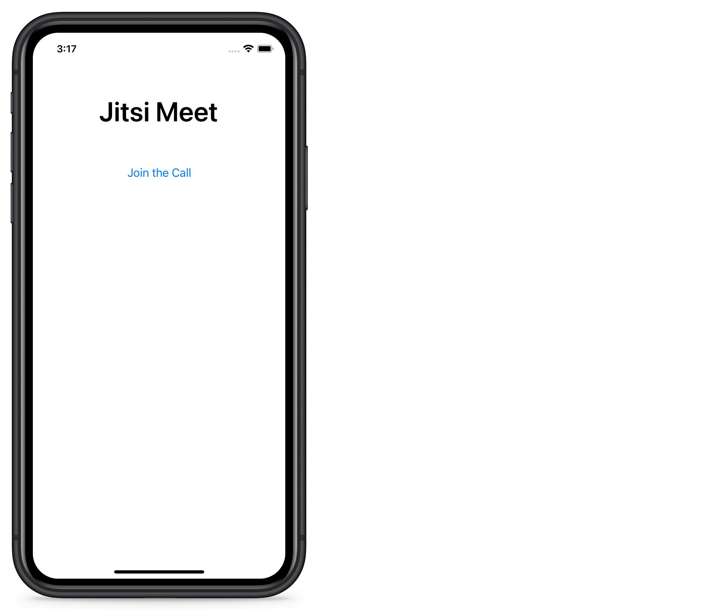
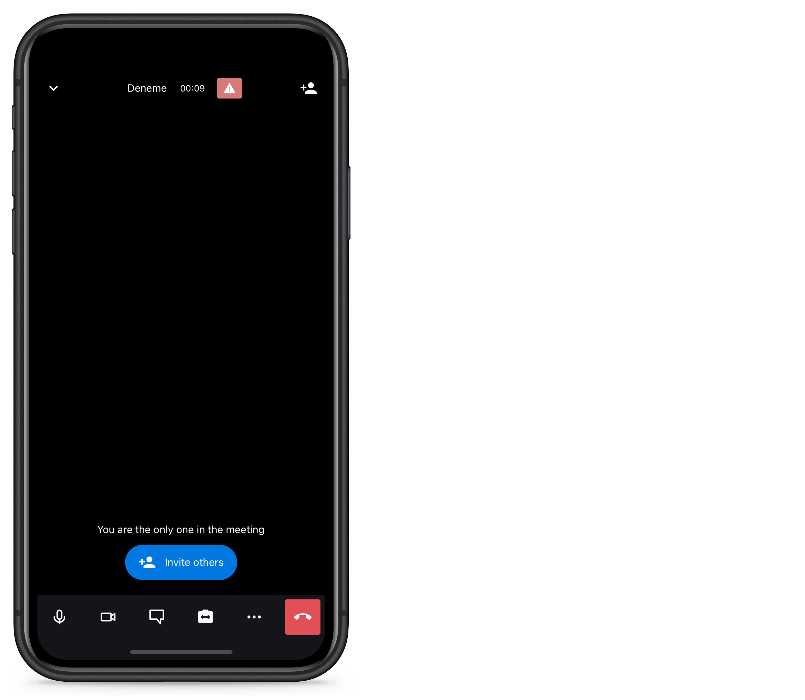

# We-Conect Mobile

This project has been delivered as a part of "We-Conect Challenge".



## macOS Build Steps

1. Install `Node` and `Watchman`

```
brew install node
brew install watchman
```

2. Install `XCode` and `Command Line Tools`
3. Install `CocoaPods`

```
sudo gem install cocoapods
```

Now you're all set. Clone the project, navigate to the project directory and then:

4. Start metro

```
npx react-native start
```

5. Open the new terminal and build the app

```
npx react-native run-ios
```

6. Play around



## About

Application has been developed using [React Native](https://reactnative.dev/) & [Typescript](https://www.typescriptlang.org/). Mockups have been created using [Figma](https://www.figma.com/).

To we.CONECT Global Leaders GmbH by Luka.
